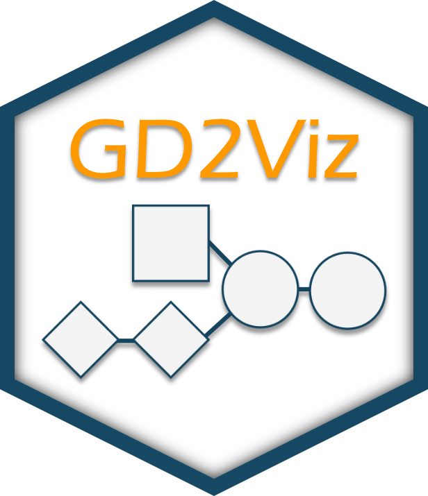
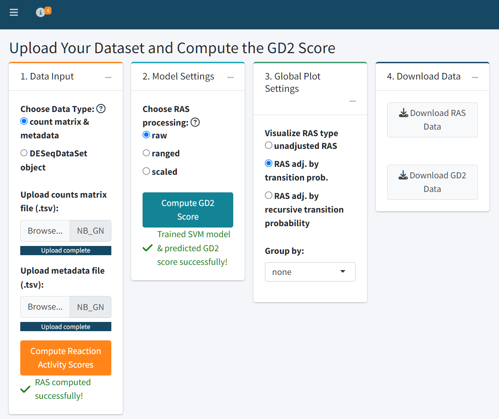

<br>
**Authors**: `r utils::packageDescription("GD2Viz")[["Author"]]`<br />
**Version**: `r utils::packageDescription("GD2Viz")$Version`<br />
**Compiled date**: `r Sys.Date()`<br />
**License**: `r utils::packageDescription("GD2Viz")[["License"]]`<br />


```{r style, echo = FALSE, results = 'asis', include = FALSE}
BiocStyle::markdown()
```

```{r global_setup, include = FALSE}
knitr::opts_chunk$set(
    collapse = TRUE,
    comment = "#>",
    error = FALSE,
    warning = FALSE,
    message = FALSE
)
stopifnot(requireNamespace("htmltools"))
htmltools::tagList(rmarkdown::html_dependency_font_awesome())
```



```{r setup}
library(GD2Viz)
```

# Introduction and scope

GD2Viz is a specialized visualization and analysis tool designed to explore the tumor-specific expression of GD2 — a disialoganglioside of growing importance in cancer immunotherapy. GD2 has emerged as a clinically actionable biomarker, due to its restricted expression in normal tissues and its elevated presence in malignancies such as neuroblastoma. Accurately assessing GD2 expression across tumor entities is pivotal for identifying patients who may benefit from targeted therapies, particularly anti-GD2 immunotherapeutics.

Building on the methodology proposed by Ustjanzew et al. (2024), GD2Viz integrates transcriptomic data with a curated model of glycosphingolipid metabolism to compute and interpret GD2 Scores. These scores reflect the net activity of pathway-level reactions called Reaction Activity Score (RAS) classified as GD2-promoting or GD2-mitigating. The framework is implemented as both an R package and an interactive Shiny application, empowering users to explore precomputed scores in large-scale public datasets or to analyze their own custom RNA-Seq data.

This vignette focuses on the Shiny application component of GD2Viz, detailing its core features and guiding users through its analytical capabilities.

While GD2Viz provides a powerful lens for examining the glycosphingolipid metabolism as it relates to GD2, users are advised to interpret GD2 Scores within the context of their computational origin. These scores are inferential by nature and should complement, not replace, direct experimental validation. Nevertheless, GD2Viz offers a scalable, transparent, and biologically grounded platform to advance the understanding and clinical utility of GD2 expression profiles in cancer research.

# Installation

GD2Viz is a stand-alone R package, so a user can start and use the application locally. However, the local version of GD2Viz does not include the exploration of public RNA-seq datasets and allows you only to load your own data tocompute the sphingolipid-pathway RAS scoresand predict the GD2 score for your samples. Please use the online version at http://shiny.imbei.uni-mainz.de:3838/GD2Viz to access the extended version and explore the GD2 scores of available public datasets.

A local installation of the latest version of R and RStudio is required.

The package can be installed with the `r BiocStyle::CRANpkg("remotes")` library:

Here’s an improved version of the **Installation** section with enhanced clarity, professional tone, and smoother language:

---

## Installation

**GD2Viz** is available as a standalone R package, enabling users to run the application locally. The local version supports the analysis of custom RNA-Seq datasets by computing Reaction Activity Scores (RAS) for the glycosphingolipid pathway and predicting GD2 Scores for user-provided samples.

> ⚠️ **Note:** The local version **does not** include access to preloaded public datasets (e.g., TCGA, GTEx, TARGET). To explore GD2 Scores across these datasets, please use the online version of the app, available at:
> [http://shiny.imbei.uni-mainz.de:3838/GD2Viz](http://shiny.imbei.uni-mainz.de:3838/GD2Viz)

### Requirements

Ensure that the latest versions of **R** and **RStudio** are installed on your system.

### Installation via `remotes`

You can install GD2Viz using the [`remotes`](https://CRAN.R-project.org/package=remotes) package:

```r
install.packages("remotes")
remotes::install_github("arsenij-ust/GD2Viz")
```

Once installed, you can launch the application locally by running:

```r
GD2Viz::GD2Viz()
```

For advanced usage, including programmatic access to functions for GD2 Score calculation and pathway analysis, refer to the vignette <TODO>.

The application is organized into three main tabs, each of which is described in detail in the following sections:

---

# Tab 'Public Datasets' (online version)


The **Public Datasets** tab provides an interactive interface to explore GD2 Scores across six major RNA-Seq datasets: 

* **TCGA Tumor**
* **TCGA Normal**
* **GTEx**
* **TARGET**
* **St. Jude Cloud**
* **CBTTC** (from the Pediatric Brain Tumor Atlas)

The RAS matrices were precomputed and are used to train a Support Vector Model (SVM) with linear kernel on the fly. The 

To ensure rapid and reproducible analysis, both adjusted and unadjusted **Reaction Activity Scores (RAS)** have been precomputed for all public datasets. Additionally, the   RAS matrices of the training dataset serve as input for a **Support Vector Machine (SVM)** with a linear kernel, which is trained on-the-fly using the specified preprocessing and adjustment settings. The trained model is then used to predict GD2 Scores across the selected dataset.

Users can control two key preprocessing settings:

### RAS Processing Method

Determines how the RAS values are prepared before being used for model training:

* **Raw**: Uses unmodified RAS values as computed from gene expression.
* **Ranged**: Normalizes each reaction’s activity score to a \[0, 1] range across all samples.
* **Scaled**: Standardizes RAS values to have zero mean and unit variance (z-score transformation).

### RAS Adjustment Type

Specifies how the RAS values are adjusted to reflect network topology and biological dependencies:

* **Unadjusted RAS**: Uses the direct output of the RAS calculation, based purely on transcriptomic input.
* **Adjusted by Transition Probability**: Weighs RAS values according to pathway transition probabilities, incorporating pathway structure.
* **Recursive Adjustment**: Further refines RAS values through iterative propagation along the reaction network, capturing upstream and downstream pathway effects.

These user-defined parameters directly influence how the training data is interpreted by the SVM model and therefore affect the resulting GD2 Score predictions. This design allows users to explore how different biological assumptions and preprocessing choices impact the characterization of GD2 expression across diverse RNA-Seq datasets.

### Visualization Options

The GD2 Score can be visualized using three plot types:

* **Scatter plot**: Ideal for viewing individual sample distributions
* **Box plot**: Useful for summarizing group-level differences
* **Violin plot**: Highlights both summary statistics and distribution density

Users can also normalize GD2 Scores to a \[0–1] range for cross-dataset comparison.

### Grouping and Highlighting

Samples can be grouped by metadata variables (e.g., *Primary\_Disease*) to contextualize GD2 Score distributions across conditions. Additionally, users may highlight specific groups — for example, highlighting **Glioblastoma Multiforme** within the TCGA dataset.

This tab is ideal for hypothesis generation, comparative analysis of cancer types with elevated GD2 expression that may be candidates for targeted anti-GD2 therapy.

### Interpretation

The zero value of the GD2 Score represents the SVM hyper plane dividing GD2-high samples from GD2-low samples. The GD2 Score of a sample is equal to the SVM decision weight of the sample. This means, samples with GD2 Score far below zero are GD2 negative, samples close to zero have an unclear/intermediate GD2 expression and samples far above zero might express high levels of GD2.

---

# Tab 'TCGA Cancer Types' (online version)


The **TCGA Cancer Types** tab enables detailed exploration of individual tumor types within the TCGA dataset. Users can select a specific TCGA project (e.g., *Glioblastoma Multiforme*) and visualize GD2 Scores across clinically or molecularly defined subgroups, such as mRNA subtypes, DNA methylation classes, or other available metadata variables.

As in the **Public Datasets** tab, users can configure key model parameters that influence the GD2 Score prediction:

* **RAS processing method**: raw, ranged, or scaled
* **RAS adjustment type**: unadjusted, adjusted by transition probability, or recursively adjusted

The resulting plot displays GD2 Scores grouped by the selected stratification variable, providing insight into intratumoral heterogeneity and subtype-specific GD2 expression.

---

### Differential Expression Analysis (DEA)


Beyond visualization, this tab includes a powerful **Differential Expression Analysis** module to investigate transcriptomic differences between GD2-defined sample groups. Users can stratify samples based on GD2 Scores using:

* A median split (GD2-high vs. GD2-low)
* A custom threshold value
* Upper- vs. lower GD2 Score percentiles

Additionally, the user can select between DESeq2 and limma-voom pipelines to compute the DEA. If you want to analyze more than 20 samples, we suggest limma-voom because the computation will be faster.

### DEA Output

The DEA results section offers a multi-faceted view of differential gene regulation:

* **Summary statistics**: Total number of upregulated and downregulated genes
* **Searchable results table**: View, filter, and sort significant genes
* **Gene-specific details**: Select any gene from the table to see additional annotation and visualize its expression distribution across GD2-defined groups
* **Interactive volcano plot**: Visualize effect size and significance
* **MA plot**: Assess expression fold changes versus mean expression
* **P-value Histogram**: Assesses the distribution of raw p-values to evaluate test validity and potential signal
* **Log2 Fold-Change Histogram**: Provides a global overview of the magnitude and directionality of differential gene expression

This integrated analysis allows users to link GD2 Score variation with broader transcriptomic changes, helping to generate hypotheses about GD2-associated pathways, biomarkers, or therapeutic targets within specific cancer types.

The results of the DEA can be downloaded.

---

# Tab 'Analyze Your Data' (local and online versions)



The **Analyze Your Data** tab enables users to upload their own **RNA-Seq datasets** and compute both **Reaction Activity Scores (RAS)** and **GD2 Scores** using the GD2Viz framework. This tab provides a full analytical pipeline, from raw counts to visualization and interpretation, all within a user-friendly interface.

### Step 1: Data Upload

Users can upload their data in one of two formats:

* **Count matrix and metadata** (`.tsv` format):

  * The count matrix should contain **raw, unnormalized counts**, with rows labeled by **Gene Symbols** and columns representing samples.
  * The metadata file should contain sample-level annotations. Column names in the count matrix must match the row names in the metadata file.

* **DESeqDataSet object** (`.rds` format):

  * This is a serialized R object containing counts and metadata, typically generated from the DESeq2 pipeline.
  
Text file with count data:


Text file with metadata (exerimental variables):


> ⚠️ Make sure your input files are properly formatted - same sample names and order. The metadata file can include experimental variables such as subtype, treatment, or batch for later grouping and analysis.

### Step 2: RAS Computation

After successful data upload, click **“Compute Reaction Activity Scores”** to calculate the raw and adjusted RAS matrices. These values represent the metabolic activity of reactions in the glycosphingolipid pathway.

### Step 3: GD2 Score Prediction

Users can select how RAS values should be preprocessed for model training:

* **Raw**: Unmodified RAS values
* **Ranged**: Normalized to \[0, 1] range
* **Scaled**: Standardized to zero mean and unit variance

Once selected, click **“Compute GD2 Score”** to train the SVM model and predict GD2 Scores based on each RAS matrix variant. The outputs can be downloaded directly as `.tsv` files.

### Step 4: Visualization and Interpretation

The **Global Plot Settings** panel lets you choose which adjusted RAS type to visualize and allows you to **group samples by any experimental variable** defined in your metadata.

---

### Visualization Panels:

1. **RAS Heatmap**

   * Displays the computed RAS matrix as an adjustable heatmap.
   * Customize row/column labels, scaling, clustering method, and distance metrics by clicking on the gears symbol.
   


2. **Promoting vs. Diminishing Reactions Scatter Plot**

   * Visualizes the sum of GD2-promoting vs. GD2-diminishing reactions used by the SVM model as predictive variables. The lines represent the GD2 Score scale, where zero is the hyper plane of the SVM model.
   


3. **Predicted GD2 Score Plot**

   * Visualize GD2 scores using scatter, box, or violin plots.
   * When scatter is selected, you can optionally plot GD2 scores against a selected gene of interest.
   
The zero value of the GD2 Score represents the SVM hyper plane dividing GD2-high samples from GD2-low samples. The GD2 Score of a sample is equal to the SVM decision weight of the sample. This means, samples with GD2 Score far below zero are GD2 negative, samples close to zero have an unclear/intermediate GD2 expression and samples far above zero might express high levels of GD2.
   


4. **GD2 Score vs. Stemness Score**

   * Explores the relationship between GD2 expression and cellular stemness, which may inform interpretation of differentiation states.
   
Refer for the Stemness score: Malta TM, Sokolov A, et al.; Cancer Genome Atlas Research Network; Stuart JM, Hoadley KA, Laird PW, Noushmehr H, Wiznerowicz M. Machine Learning Identifies Stemness Features Associated with Oncogenic Dedifferentiation. Cell. 2018 Apr 5;173(2):338-354.e15. doi: 10.1016/j.cell.2018.03.034.
   


---

### Group Comparison and Pathway Analysis


Users can compare two experimental groups to examine shifts in glycosphingolipid metabolism:

* **Log2 Fold Change Plot**:
  Highlights up- and downregulated reactions within the glycosphingolipid pathway.

* **Ganglioside Pathway Visualization**:
  Provides a detailed graphical analysis of ganglioside-specific reactions.

---

### Differential Expression Analysis (DEA)

The final section mirrors the functionality of the **TCGA Cancer Types** tab. Users can perform DEA using GD2 score-based stratification:

* Define GD2-high vs. GD2-low groups using the median, percentiles, or custom thresholds
* Run the analysis and visualize results with:

  * **Summary stats** on up/downregulated genes
  * **Interactive volcano plot**
  * **MA plot**
  * **P-value histogram**
  * **Log2 fold-change histogram**
  * **Searchable results table**
  * **Gene-specific expression plots**

This allows comprehensive exploration of transcriptomic changes associated with GD2 phenotypes in user-defined datasets.


