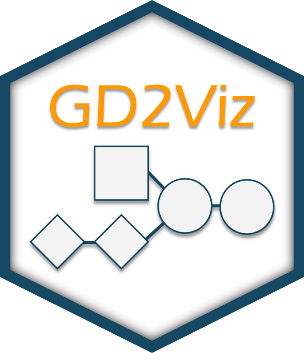
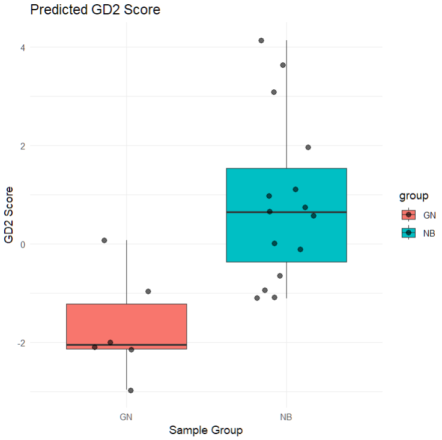

<br>
**Authors**: `r utils::packageDescription("GD2Viz")[["Author"]]`<br />
**Version**: `r utils::packageDescription("GD2Viz")$Version`<br />
**Compiled date**: `r Sys.Date()`<br />
**License**: `r utils::packageDescription("GD2Viz")[["License"]]`<br />


```{r style, echo = FALSE, results = 'asis', include = FALSE}
BiocStyle::markdown()
```

```{r global_setup, include = FALSE}
knitr::opts_chunk$set(
    collapse = TRUE,
    comment = "#>",
    error = FALSE,
    warning = FALSE,
    message = FALSE
)
stopifnot(requireNamespace("htmltools"))
htmltools::tagList(rmarkdown::html_dependency_font_awesome())
```



---

# Vignette: Computing GD2 Scores Programmatically Using GD2Viz

This vignette demonstrates how to use the **GD2Viz** R package to compute Reaction Activity Scores and predict GD2 Scores for the GSE147635 dataset, which includes neuroblastoma (NB) and ganglioneuroma (GN) samples. This workflow uses pre-trained models and pathway graphs from the GD2Viz package and walks through the process step by step using base R and Bioconductor conventions.

## 1. Load Required Libraries

```r
library(DESeq2)
library(SummarizedExperiment)
library(GD2Viz)
library(AnnotationDbi)
library(org.Hs.eg.db)
library(kernlab)
```

## 2. Load Training Data and Metabolic Graph

```r
train.data <- readRDS(system.file("extdata", "train_data.Rds", package = "GD2Viz"))
mgraph <- readRDS(system.file("extdata", "substrate_graph.Rds", package = "GD2Viz"))
```

These are precomputed resources required by `GD2Viz` for RAS computation and model training.

---

## 3. Load and Prepare the GSE147635 Dataset

### 3.1 Read Raw Count Files

In this setup the count files (.tsv) per sample are located in `data/GSE147635-counts`

```r
counts_dir <- "./data/GSE147635-counts"
count_files <- list.files(counts_dir)

file_path <- file.path(counts_dir, count_files[1])
df <- read.table(file_path, header = FALSE, sep = "\t")
names(df) <- c("rowname", count_files[1])

for (file in count_files[-1]) {
  file_path <- file.path(counts_dir, file)
  temp_df <- read.table(file_path, header = FALSE, sep = "\t")
  names(temp_df) <- c("rowname", file)
  df <- cbind(df, temp_df[, file, drop = FALSE])
}
```

### 3.2 Construct Count Matrix, Metadata, and Annotation

```r
rownames(df) <- df$rowname
df <- df[, -1]
colnames(df) <- gsub("_count.tsv", "", colnames(df))

# Remove cell line samples
NB_CL <- c("SRR11434496", "SRR11434497", "SRR11434498")
df <- df[, !colnames(df) %in% NB_CL]

# Metadata
coldata_NB_GN <- data.frame(type = c(rep("GN", 6), rep("NB", 15)))
rownames(coldata_NB_GN) <- colnames(df)

# Annotation using ENSEMBL -> SYMBOL and ENTREZ
ensemblIDs <- gsub("\\..*", "", rownames(df))
geneSymbol <- AnnotationDbi::mapIds(org.Hs.eg.db, keys = ensemblIDs, keytype = "ENSEMBL", column = "SYMBOL")
entrezIDs <- AnnotationDbi::mapIds(org.Hs.eg.db, keys = ensemblIDs, keytype = "ENSEMBL", column = "ENTREZID")
rowdata <- data.frame(ensemblIDs = ensemblIDs, geneSymbol = geneSymbol, entrezIDs = entrezIDs, row.names = rownames(df))
```

### 3.3 Create a DESeqDataSet

```r
NB_GN_dds <- DESeqDataSetFromMatrix(df, coldata_NB_GN, design = ~type)
rowData(NB_GN_dds) <- rowdata

# Keep only genes with valid symbols and remove duplicates
NB_GN_dds <- NB_GN_dds[!is.na(rowData(NB_GN_dds)$geneSymbol), ]
NB_GN_dds <- NB_GN_dds[!duplicated(rowData(NB_GN_dds)$geneSymbol), ]
rownames(NB_GN_dds) <- rowData(NB_GN_dds)$geneSymbol
```

```
# inspect dds object
> NB_GN_dds
class: DESeqDataSet 
dim: 60603 21 
metadata(1): version
assays(1): counts
rownames(60603): ENSG00000000003.14 ENSG00000000005.6 ... ENSG00000288110.1 ENSG00000288111.1
rowData names(3): ensemblIDs geneSymbol entrezIDs
colnames(21): SRR11434490 SRR11434491 ... SRR11434512 SRR11434513
colData names(1): type
```

---

## 4. Compute Reaction Activity Scores (RAS)

```r
res <- computeReactionActivityScores(dds = NB_GN_dds, mgraph = mgraph, geom = metadata(train.data)$geom)
```

This computes unadjusted and adjusted RAS matrices (`ras`, `ras_prob`, and `ras_prob_rec`) using the glycosphingolipid pathway structure.

---

## 5. Train GD2 Models

```r
kernfit.ras <- trainGD2model(train.data, adjust_ras = "ras", adjust_input = "raw", type_column = "X_study")
kernfit.ras_prob <- trainGD2model(train.data, adjust_ras = "ras_prob", adjust_input = "raw", type_column = "X_study")
kernfit.ras_prob_rec <- trainGD2model(train.data, adjust_ras = "ras_prob_rec", adjust_input = "raw", type_column = "X_study")
```

Each model corresponds to a different RAS adjustment strategy, but all are trained on raw input.

```
# inspect object
> kernfit.ras
Support Vector Machine object of class "ksvm" 

SV type: C-svc  (classification) 
 parameter : cost C = 1 

Linear (vanilla) kernel function. 

Number of Support Vectors : 159 

Objective Function Value : -142.1803 
Training error : 0.006227 

```

---

## 6. Predict GD2 Scores

```r
GD2res.ras <- computeGD2Score(res$ras, kernfit.ras, adjust_input = "raw", range_output = FALSE, center = TRUE)
GD2res.ras_prob <- computeGD2Score(res$ras_prob, kernfit.ras_prob, adjust_input = "raw", range_output = FALSE, center = TRUE)
GD2res.ras_prob_rec <- computeGD2Score(res$ras_prob_rec, kernfit.ras_prob_rec, adjust_input = "raw", range_output = FALSE, center = TRUE)
```

Each `GD2res` object contains predicted GD2 scores for your dataset based on the corresponding RAS matrix.

* `GD2res.ras$preds` contains the predicted GD2 score per sample.
* `GD2res.ras$input_df` contains the sum of RAS of GD2 promoting (x) and GD2 mitigating (y) reactions.

```
# inspect output
> GD2res.ras
$preds
SRR11434490 SRR11434491 SRR11434492 SRR11434493 SRR11434494 SRR11434495 SRR11434499 SRR11434500 SRR11434501 SRR11434502 SRR11434503 SRR11434504 SRR11434505 SRR11434506 
-3.15969556 -3.80965863 -3.26173346 -2.31618710 -3.01514854 -1.84682457  1.90205071  0.02774619 -1.26444071  3.32799785  3.61805815  2.71453233  0.41832016 -1.70589323 
SRR11434507 SRR11434508 SRR11434509 SRR11434510 SRR11434511 SRR11434512 SRR11434513 
 0.39124098  0.35011671  0.42324510 -1.84380660  0.64591858 -0.63152673 -1.46629172 

$input_df
                   x         y
SRR11434490 5.304108 11.917678
SRR11434491 4.740051 10.970778
SRR11434492 5.009035 11.282669
SRR11434493 5.330185 11.484064
SRR11434494 5.079104 11.302970
SRR11434495 5.114256 10.700104
SRR11434499 5.764573 10.031501
SRR11434500 5.627962 10.809748
SRR11434501 5.511242 11.293214
SRR11434502 5.970077  9.678619
SRR11434503 6.142886  9.915355
SRR11434504 5.981041 10.064461
SRR11434505 5.808792 11.006384
SRR11434506 5.442241 11.389793
SRR11434507 6.017730 11.514321
SRR11434508 5.844057 11.129459
SRR11434509 5.531588 10.350686
SRR11434510 5.654024 11.969471
SRR11434511 5.778696 10.801939
SRR11434512 5.593311 11.115050
SRR11434513 5.758643 11.994297
```

---

## 7. Visualize GD2 Scores

### Grouped Boxplot by Sample Type

```r
df_plot <- data.frame(
  sample = names(GD2res.ras_prob$preds),
  GD2_score = GD2res.ras_prob$preds,
  group = colData(NB_GN_dds)$type
)

ggplot2::ggplot(df_plot, ggplot2::aes(x = group, y = GD2_score, fill = group)) +
  ggplot2::geom_boxplot() +
  ggplot2::geom_jitter(width = 0.2, size = 2, alpha = 0.6) +
  ggplot2::labs(
    title = "Predicted GD2 Score",
    x = "Sample Group",
    y = "GD2 Score"
  ) +
  ggplot2::theme_minimal()
```



This plot helps distinguish GD2-high and GD2-low phenotypes between NB and GN groups, and can inform potential downstream DEA or biomarker analysis.

---

## Summary

This vignette demonstrated how to:

* Preprocess RNA-seq count data from GSE147635
* Annotate and format data into a `DESeqDataSet`
* Compute Reaction Activity Scores using a metabolic graph
* Train and apply GD2 prediction models
* Visualize predicted GD2 scores by sample group


